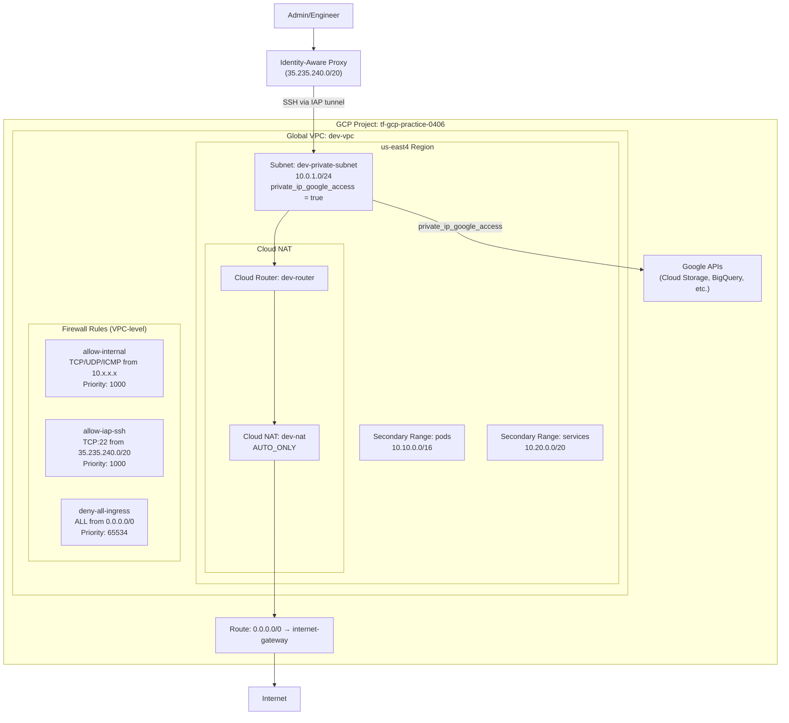

# GCP Terraform Interview Practice

Practice Terraform configs for a Google Cloud Engineer role (DoD/IC).
Each phase builds on the previous one, adding complexity incrementally.

## Architecture Overview

## Phases

| Phase | Description | Status |
|-------|-------------|--------|
| [01-networking](phases/01-networking/) | VPC, subnets, firewall rules, Cloud NAT | Applied |
| [02-compute](phases/02-compute/) | Compute Engine + custom service account | Pending |
| [03-database](phases/03-database/) | Cloud SQL + private VPC peering | Pending |
| [04-gke](phases/04-gke/) | Private GKE cluster + Workload Identity | Pending |
| [05-modules](phases/05-modules/) | Refactor into reusable modules | Pending |
| [06-cicd](phases/06-cicd/) | Cloud Build CI/CD pipeline | Pending |

## GCP vs AWS Quick Reference

| Concept | GCP | AWS |
|---------|-----|-----|
| VPC scope | **Global** | Regional |
| Subnet scope | **Regional** (all zones) | Per-AZ |
| Firewall | VPC-level, **target tags** | Security groups per-ENI |
| Private API access | `private_ip_google_access` | VPC Gateway Endpoints |
| NAT | Cloud NAT (managed) | NAT Gateway |
| SSH without public IP | **IAP tunneling** | SSM Session Manager |
| Instance identity | **Service accounts** | Instance profiles/roles |
| K8s pod identity | **Workload Identity** | IRSA |
| Account isolation | **Projects** | AWS Accounts |
| GovCloud equivalent | **Assured Workloads** | AWS GovCloud |
| Org hierarchy | Org → Folders → Projects | Org → OUs → Accounts |

## Security Checklist (DoD/FedRAMP)

Every Terraform config in this repo follows these patterns:

- [x] `auto_create_subnetworks = false` — no default subnets
- [x] `private_ip_google_access = true` — private access to Google APIs
- [x] No `access_config` on VMs — no public IPs
- [x] IAP for SSH — no bastion hosts, IAM-authenticated access
- [x] VPC flow logs enabled — NIST 800-53 AU controls
- [x] `ipv4_enabled = false` on Cloud SQL — no public database endpoint
- [x] Dedicated service accounts — never use default compute SA
- [x] `sensitive = true` on secrets — no passwords in plan output
- [x] `.id` references — proper Terraform dependency tracking
- [x] `for_each` over `count` — stable resource addressing
