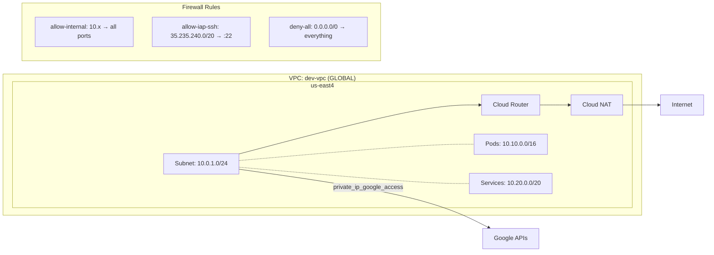

# Phase 1: Networking

Private VPC foundation for a DoD/IC GCP environment.

## Architecture



## Resources Created

| Resource | Name | Purpose |
|----------|------|---------|
| `google_compute_network` | dev-vpc | Global VPC, no auto-subnets |
| `google_compute_subnetwork` | dev-private-subnet | Regional subnet with flow logs |
| `google_compute_router` | dev-router | Regional router for Cloud NAT |
| `google_compute_router_nat` | dev-nat | Outbound internet for private VMs |
| `google_compute_route` | dev-internet-route | Default route to internet gateway |
| `google_compute_firewall` | dev-allow-internal | Internal VPC communication |
| `google_compute_firewall` | dev-allow-iap-ssh | SSH via IAP tunneling only |
| `google_compute_firewall` | dev-deny-all-ingress | Explicit deny-all (defense in depth) |

## Key Decisions & Interview Talking Points

### Why `auto_create_subnetworks = false`?
Default subnets create a subnet in **every** region with a predetermined CIDR. In DoD environments you need explicit control over IP space — no surprise subnets, no wasted ranges, no attack surface in regions you don't use.

**AWS analogy:** This is like always deleting the default VPC.

### Why `delete_default_routes_on_create = true`?
Principle of least privilege applied to networking. Start with zero routes, add back only what you need. The default route to the internet is added back explicitly via `google_compute_route`.

### Why IAP instead of a bastion host?
- **IAP tunneling** authenticates via IAM (supports MFA, org policies, conditional access)
- Full audit trail in Cloud Audit Logs (who SSH'd where, when)
- No bastion instance to patch, harden, or pay for
- Source range `35.235.240.0/20` is Google's IAP service, NOT the public internet
- **AWS analogy:** SSM Session Manager

### Why secondary IP ranges on the subnet?
GKE requires **dedicated secondary ranges** for pod and service IPs — it cannot share the primary subnet CIDR. Defining them upfront means Phase 4 (GKE) plugs in without modifying the networking layer.

### Why VPC flow logs at 100% sampling?
FedRAMP and NIST 800-53 (AU-family controls) require network traffic logging. 100% sampling ensures no gaps. In production you might reduce sampling for cost, but only if the ATO explicitly allows it.

### Why `private_ip_google_access = true`?
VMs without public IPs can't reach Google APIs (Cloud Storage, BigQuery, Container Registry) unless this is enabled. It creates internal routes to Google's API endpoints.

**AWS analogy:** VPC Gateway Endpoints for S3/DynamoDB — but this one flag covers ALL Google APIs.

## Usage

```bash
cp example.tfvars terraform.tfvars
# Edit with your project ID
terraform init
terraform plan
terraform apply
```

## Outputs

These outputs are consumed by later phases:

- `vpc_id` / `vpc_name` — referenced by Compute, Cloud SQL, GKE
- `subnet_id` / `subnet_name` — where instances and GKE nodes deploy
- `pod_range_name` / `service_range_name` — required by GKE cluster config
