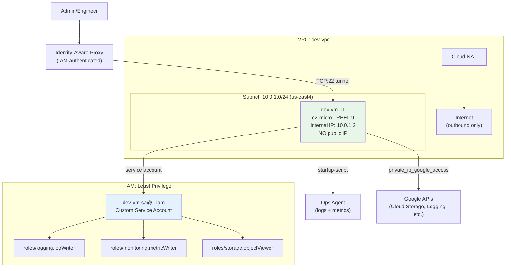

# Phase 2: Compute Engine + Custom Service Account

A private Compute Engine instance with a least-privilege service account, deployed into the Phase 1 VPC.

## Architecture



## Resources Created

| Resource | Name | Purpose |
|----------|------|---------|
| `google_service_account` | dev-vm-sa | Dedicated SA with least-privilege roles |
| `google_project_iam_member` | vm_log_writer | `roles/logging.logWriter` |
| `google_project_iam_member` | vm_metric_writer | `roles/monitoring.metricWriter` |
| `google_project_iam_member` | vm_storage_viewer | `roles/storage.objectViewer` |
| `google_compute_instance` | dev-vm-01 | RHEL 9 VM, no public IP, Shielded VM |

## Key Decisions & Interview Talking Points

### Why a custom service account instead of the default?
The default Compute Engine SA (`PROJECT_NUM-compute@developer.gserviceaccount.com`) gets `roles/editor` on the entire project. That's read/write access to almost everything. In DoD environments, this violates least-privilege and is an instant audit finding.

**AWS analogy:** It's like every EC2 instance having an admin IAM role by default.

### Why no `access_config` block?
In GCP, the **absence** of `access_config` means no public IP. This is the opposite of how most people think about it:
- `access_config {}` = **public IP assigned** (even empty block!)
- No `access_config` = **no public IP**

If you see `access_config {}` in a code review, flag it.

**AWS analogy:** `associate_public_ip_address = false`

### Why `scopes = ["cloud-platform"]`?
Scopes are a legacy access control layer. `cloud-platform` means "allow whatever IAM says." You control access through IAM roles, not scopes. Using narrow scopes doesn't add security — it just creates confusing behavior where IAM says "yes" but scopes say "no."

### Why OS Login instead of SSH keys?
- OS Login maps **GCP IAM identities** to Linux users
- Access is controlled via IAM (`roles/compute.osLogin` or `roles/compute.osAdminLogin`)
- Full audit trail — who logged in, when, from where
- No SSH keys to rotate or manage
- **AWS analogy:** EC2 Instance Connect

### Why Shielded VM?
- **Secure Boot:** Only verified bootloader/kernel can run
- **vTPM:** Virtual Trusted Platform Module for measured boot
- **Integrity Monitoring:** Alerts on boot sequence changes
- Required for FedRAMP/CMMC compliance
- **AWS analogy:** Nitro-based instances with Secure Boot

### How to SSH into this VM (no public IP)?
```bash
gcloud compute ssh dev-vm-01 --zone=us-east4-b --tunnel-through-iap
```
IAP creates an encrypted tunnel through Google's infrastructure. Your SSH traffic never touches the public internet.

## Usage

```bash
cp example.tfvars terraform.tfvars
terraform init
terraform plan
terraform apply
```
