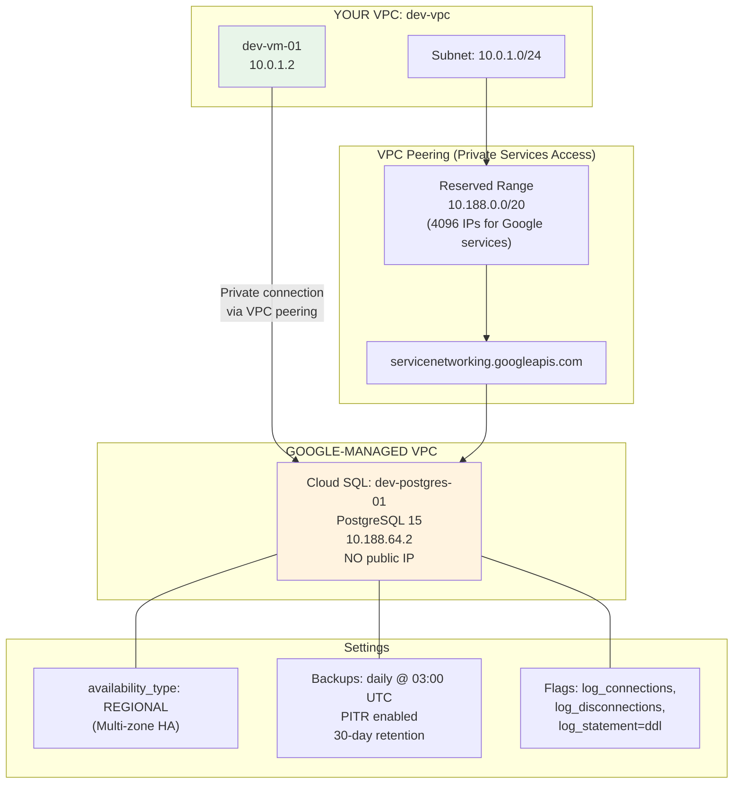
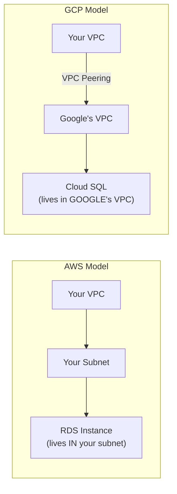

# Phase 3: Cloud SQL with Private VPC Peering

PostgreSQL database with private-only access via VPC peering to Google's managed service network.

## Architecture



## The Big Difference from AWS



**AWS RDS** sits inside your subnet — you pick the subnet group, attach security groups, done.

**GCP Cloud SQL** runs in a **Google-managed VPC**. You must set up VPC peering (Private Services Access) to reach it privately. This means:
1. Reserve an IP range in your VPC for Google to use
2. Create a peering connection to `servicenetworking.googleapis.com`
3. Point Cloud SQL at your VPC via `private_network`

## Resources Created

| Resource | Name | Purpose |
|----------|------|---------|
| `google_compute_global_address` | dev-private-services-range | Reserved /20 for Google managed services |
| `google_service_networking_connection` | private_services | VPC peering to Google's service network |
| `google_sql_database_instance` | dev-postgres-01 | PostgreSQL 15, private IP only, HA, backups |
| `google_sql_database` | app | Application database |
| `google_sql_user` | app_user | Database user (password via sensitive variable) |

## Key Decisions & Interview Talking Points

### Why Private Services Access instead of public IP?
Cloud SQL with `ipv4_enabled = true` gets a public IP. Even with SSL and authorized networks, a publicly-addressable database is an audit finding in DoD environments. Private Services Access ensures the database is only reachable from your VPC via peering — no internet path exists.

### Why `depends_on` for the Cloud SQL instance?
The VPC peering (`google_service_networking_connection`) must complete before Cloud SQL can use it. Terraform can't infer this dependency from the resource arguments alone — the `private_network` reference points to the VPC, not the peering connection. This is one of the cases where explicit `depends_on` is necessary.

### Why `deletion_policy = "ABANDON"` on the peering?
If you destroy the peering before destroying Cloud SQL instances that use it, the destroy will fail. `ABANDON` means Terraform releases the resource from state without actually deleting the peering — safer for teardown ordering.

### Why `sensitive = true` on the password variable?
Prevents the password from appearing in `terraform plan` output, CLI logs, or CI/CD pipeline logs. The password is still stored in the state file in plaintext — this is why encrypted remote state (GCS bucket with CMEK) is mandatory for production.

### Why `availability_type = "REGIONAL"`?
Regional = multi-zone HA with automatic failover. If the primary zone goes down, Cloud SQL fails over to the standby in another zone. For FedRAMP, this maps to CP (Contingency Planning) controls.

### Cloud SQL Review Checklist
Every Cloud SQL config review, check these 4 things:
1. `ipv4_enabled` — must be `false`
2. `authorized_networks` — should not exist if using private IP
3. Password handling — variable with `sensitive = true`, never hardcoded
4. Backup/HA — `backup_configuration` enabled, `availability_type = "REGIONAL"`

## Usage

```bash
cp example.tfvars terraform.tfvars
# Edit with your project ID and set a real password
terraform init
terraform plan
terraform apply
```

## Connecting to the Database

From the VM in Phase 2 (which is in the same VPC):
```bash
# SSH into the VM via IAP
gcloud compute ssh dev-vm-01 --zone=us-east4-b --tunnel-through-iap

# Connect using Cloud SQL Proxy (recommended)
cloud-sql-proxy tf-gcp-practice-0406:us-east4:dev-postgres-01

# Or direct connection (from within the VPC)
psql -h 10.188.64.2 -U app_user -d app
```
